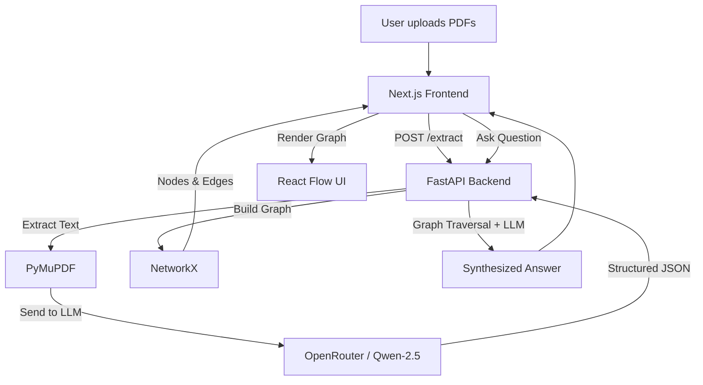

# 🕸️ GraphRAG Literature Review Assistant

**Synthesize academic literature through structured knowledge graphs. Go beyond standard RAG to uncover cross-paper relationships, contradictions, and research gaps.**

[](https://www.python.org/)
[](https://nextjs.org/)
[](LICENSE)
[]()

---

## 📖 About

Reviewing academic literature typically involves reading multiple papers independently and manually identifying how they relate. Existing AI-powered PDF tools (e.g., ChatPDF) rely on standard vector-based Retrieval-Augmented Generation (RAG). While useful for single-document Q&A, they treat papers as isolated blocks of text and struggle with **cross-paper relational questions**.

**GraphRAG Literature Review Assistant** solves this by extracting structured knowledge from research papers and building a dynamic Knowledge Graph. It connects papers through shared concepts, methods, datasets, and citations, enabling deep synthesis and highly traceable answers.

## ✨ Key Features

- **Structured Knowledge Extraction:** Automatically parses PDFs to extract Methods, Datasets, Claims, and Results using advanced LLMs.
- **Dynamic Knowledge Graph:** Visualizes connections between papers. See exactly which methods overlap and which results conflict.
- **Cross-Paper Synthesis:** Ask complex questions like *"What are the common research gaps across these papers?"* and get grounded, cited answers.
- **Interactive UI:** Beautiful, animated graph visualization (powered by React Flow) paired with a streaming chat interface.
- **Traceability:** Every answer is linked back to specific nodes and source papers in the graph.

## 🏗️ Architecture & Tech Stack

The application is built with a decoupled, production-grade architecture.

### 🎨 Frontend — Next.js

- **Framework:** Next.js 14+ (App Router, TypeScript)
- **Graph Visualization:** `@xyflow/react` (React Flow) for interactive node graphs.
- **UI Components:** `shadcn/ui` & Tailwind CSS for a polished, modern design.
- **AI Chat:** Vercel AI SDK for streaming LLM responses.
- **Animations:** Framer Motion for smooth transitions.

### ⚙️ Backend — FastAPI

- **Framework:** FastAPI (Python)
- **Graph Engine:** NetworkX for in-memory graph construction and traversal.
- **PDF Parsing:** PyMuPDF for high-fidelity text extraction.
- **LLM Integration:** OpenRouter API using `qwen/qwen-2.5-72b-instruct` for structured JSON extraction.
- **Data Validation:** Pydantic for strict schema enforcement.

### 🔄 System Architecture



## 🚀 Getting Started

### Prerequisites

- Node.js 18+ and npm
- Python 3.10+
- [uv](https://docs.astral.sh/uv/)
- An API key from [OpenRouter](https://openrouter.ai/) or OpenAI/Groq

### 1. Backend Setup

```bash
cd backend

uv sync

uv run uvicorn app.main:app --reload
```

The backend will be running at:

```text
http://localhost:8000
```

### 2. Frontend Setup

```bash
cd frontend

npm install

npm run dev
```

The frontend will be running at:

```text
http://localhost:3000
```

## 📊 Benchmarking & Success Metrics

This project is designed to demonstrate the advantages of graph-structured retrieval over standard vector-RAG.

We evaluate the system based on:

1. **Factual Accuracy:** Parity with standard RAG on single-paper factual questions.
2. **Relational Accuracy:** The primary differentiator — accuracy on cross-paper questions such as method overlap and contradictions.
3. **Synthesis Quality:** Depth and usefulness of answers regarding common research gaps.
4. **Traceability:** Ability to link every claim in the generated answer back to a specific graph node and source PDF.

## 🗺️ Roadmap

- **V1:** Core extraction pipeline, FastAPI backend, NetworkX graph construction.
- **V2:** Next.js frontend, React Flow visualization, and chat interface.
- **V3:** Hybrid Retrieval — Vector DB + Graph Traversal router.
- **V4:** Neo4j integration for persistent, large-scale graph storage.
- **V5:** Automated benchmarking suite against generic PDF summarizers.

## 🤝 Contributing

Contributions, issues, and feature requests are welcome!

Feel free to check the project's issues page for open tasks and feature requests.

## 📄 License

This project is licensed under the **MIT License**.