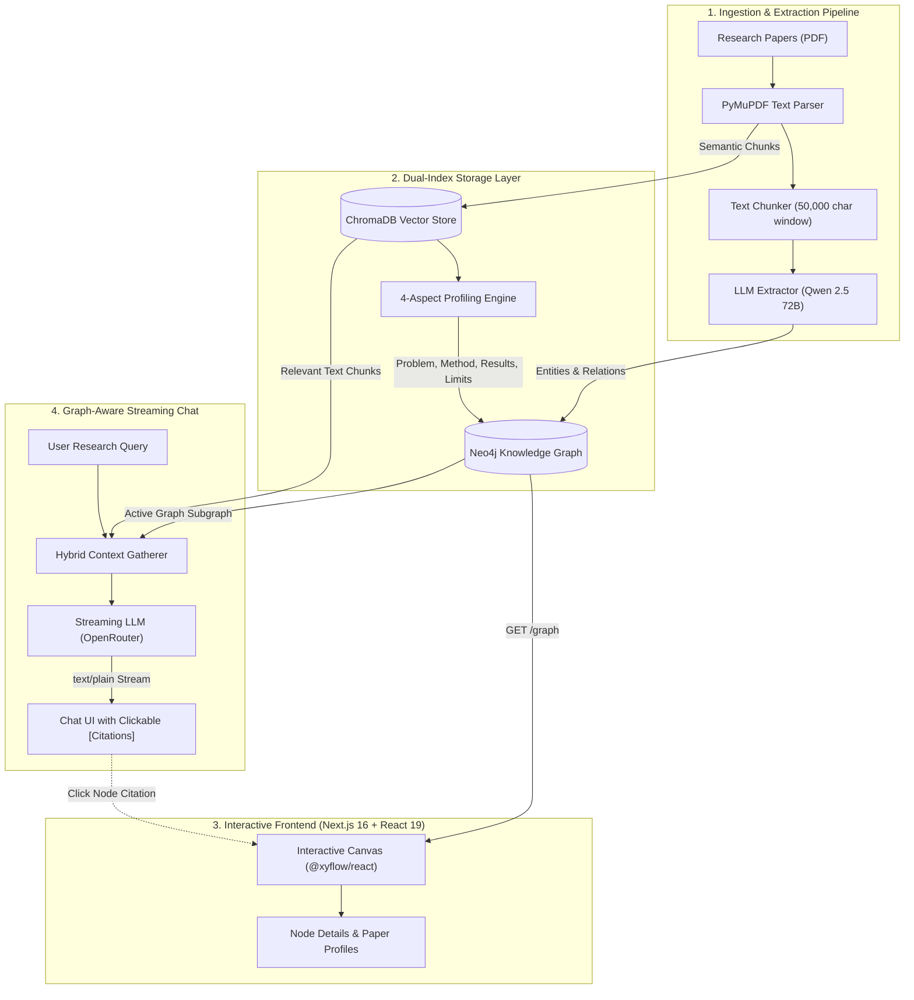

# GraphMind: Academic Literature Review Assistant

[](https://nextjs.org/)
[](https://react.dev/)
[](https://fastapi.tiangolo.com/)
[](https://python.org)
[](https://neo4j.com/)
[](https://trychroma.com/)
[](https://tailwindcss.com/)
[](LICENSE)

> Transform multiple academic research PDFs into an interactive, interconnected knowledge graph for cross-paper synthesis and citation-grounded conversational reasoning.

---

## Overview

Traditional Retrieval-Augmented Generation (RAG) divides documents into arbitrary text chunks and retrieves isolated passages based on vector similarity. While effective for single-fact lookups, standard RAG struggles with synthesizing multi-paper corpora—it cannot easily answer structural questions such as *"Which methodologies are shared across Paper A and Paper B?"* or *"What claims directly challenge or extend prior work?"*.

**GraphMind** addresses this challenge by pairing **Graph Databases (Neo4j)** and **Vector Stores (ChromaDB)** with targeted LLM information extraction:

1. **Entity and Relation Extraction**: Discovers `Paper`, `Method`, and `Claim` entities alongside typed semantic links (`uses_method`, `makes_claim`, `evaluates_on`).
2. **Persistent Knowledge Graph**: Constructs a persistent knowledge network in Neo4j that can be rehydrated and explored interactively.
3. **Automated Grounded Profiling**: Synthesizes a structured 4-part summary (*Problem*, *Method*, *Results*, *Limitations*) anchored by vector search across the source text.
4. **Graph-Aware Conversational Interface**: Blends relational graph context with text passage retrieval to stream answers with interactive, clickable citations that highlight matching nodes on the canvas.

---

## System Architecture & Data Flow



---

## Key Capabilities

- **Multi-Document Ingestion**: Process multiple academic papers simultaneously into a cohesive, non-redundant knowledge network.
- **Structured Ontology**: Extracts distinct entities (`Paper`, `Method`, `Claim`) and typed relations (`uses_method`, `makes_claim`, `proposes`).
- **Persistent Graph Storage**: Powered by Neo4j for scalable relational persistence, graph traversals, and multi-session rehydration.
- **4-Part Grounded Paper Profiles**: Automatically queries ChromaDB for each paper's *Problem*, *Method*, *Results*, and *Limitations*, attaching grounded summaries directly to `Paper` nodes.
- **Streaming Academic Q&A**: Stream conversational answers token-by-token with dual context from both the knowledge graph structure and raw text passages.
- **Interactive In-Text Graph Citations**: Bracketed citations such as `[Transformer]` in chat responses are interactive—clicking them navigates and highlights matching nodes on the canvas.
- **Canvas Exploration**: React Flow (`@xyflow/react`) interface featuring smooth zoom/pan controls, type filtering, mini-map, and node detail drawers.

---

## Tech Stack

### Frontend (`/frontend`)

| Component | Technology |
|---|---|
| Framework | [Next.js 16 (App Router)](https://nextjs.org/) + [React 19](https://react.dev/) |
| Language | TypeScript |
| Canvas Engine | [@xyflow/react (React Flow)](https://reactflow.dev/) |
| State Management | [Zustand](https://github.com/pmndrs/zustand) |
| UI & Styling | [Tailwind CSS v4](https://tailwindcss.com/), Radix UI, Lucide Icons, Framer Motion |
| Package Manager | `pnpm` (pinned to v11.8.0) |

### Backend (`/backend`)

| Component | Technology |
|---|---|
| API Framework | [FastAPI](https://fastapi.tiangolo.com/) + [Uvicorn](https://www.uvicorn.org/) |
| Language | Python 3.12+ / 3.14 |
| Graph Database | [Neo4j](https://neo4j.com/) via official `neo4j` Python driver |
| Vector Database | [ChromaDB](https://www.trychroma.com/) |
| Document Parser | [PyMuPDF (fitz)](https://pymupdf.readthedocs.io/) |
| LLM Client | OpenAI SDK configured for OpenRouter (`qwen/qwen-2.5-72b-instruct`) |
| Package Manager | [`uv`](https://docs.astral.sh/uv/) |

---

## Repository Layout

```text
GraphMind/
├── backend/
│   ├── pyproject.toml              # Dependencies, build & Ruff configuration
│   ├── .env.example                # Template for backend environment variables
│   └── src/backend/
│       ├── main.py                 # FastAPI application & route definitions
│       ├── database.py             # Neo4j connection & graph persistence helpers
│       ├── vector_store.py         # ChromaDB chunk indexing & similarity search
│       ├── models/
│       │   └── schema.py           # Pydantic models (Entity, Relationship, ExtractionResult)
│       ├── parser/
│       │   └── pdf_parser.py       # PyMuPDF-based text extraction from PDF files
│       ├── graph/
│       │   └── builder.py          # NetworkX graph aggregation & formatting
│       └── extractors/
│           └── openai_ext.py       # LLM extraction prompts, profiling & streaming chat
├── frontend/
│   ├── package.json                # Frontend scripts and dependencies
│   ├── .env.example                # Template for frontend environment variables
│   └── src/
│       ├── app/                    # Next.js App Router layout & pages
│       ├── components/             # UI components (GraphCanvas, ChatPanel, Sidebar, NodeDetailPanel)
│       ├── lib/
│       │   ├── api.ts              # API client methods for /extract, /graph, and /chat
│       │   └── graphMapper.ts      # Adapts backend graph JSON to React Flow node/edge models
│       ├── store/
│       │   └── useGraphStore.ts    # Global Zustand store for nodes, edges, chat, and active filters
│       └── types/
│           └── index.ts            # Frontend TypeScript definitions
└── README.md
```

---

## Quickstart Guide

### Prerequisites

Ensure the following tools are available on your system:
- **Node.js**: `v20.x` or later
- **pnpm**: `v9.x` or later (or enable via `corepack enable pnpm`)
- **Python**: `3.12+` or `3.14`
- **uv**: Fast Python package manager ([Installation Guide](https://docs.astral.sh/uv/getting-started/installation/))
- **Neo4j Instance**: Local Neo4j Desktop / Docker container, or a free cloud instance on [Neo4j AuraDB](https://neo4j.com/cloud/platform/aura-graph-database/)
- **OpenRouter API Key**: Obtainable from [OpenRouter](https://openrouter.ai/) (access to `qwen/qwen-2.5-72b-instruct` or compatible models)

---

### 1. Backend Setup

1. Navigate to the backend directory:
   ```bash
   cd backend
   ```

2. Install dependencies:
   ```bash
   uv sync
   ```

3. Create your `.env` configuration file:
   ```bash
   cp .env.example .env
   ```

4. Populate `backend/.env` with your credentials:
   ```env
   # LLM Provider Configuration (OpenRouter)
   OPENROUTER_API_KEY=sk-or-v1-your-key-here
   OPENAI_BASE_URL=https://openrouter.ai/api/v1

   # Neo4j Graph Database
   NEO4J_URI=neo4j+s://your-instance.databases.neo4j.io
   NEO4J_USERNAME=neo4j
   NEO4J_PASSWORD=your_secure_password
   ```

5. Launch the FastAPI server:
   ```bash
   uv run uvicorn backend.main:app --app-dir src --reload --host 0.0.0.0 --port 8000
   ```

   The backend will be live at `http://localhost:8000`. Interactive OpenAPI documentation is accessible at `http://localhost:8000/docs`.

---

### 2. Frontend Setup

1. Open a new terminal window and navigate to the frontend directory:
   ```bash
   cd frontend
   ```

2. Install dependencies:
   ```bash
   pnpm install
   ```

3. Configure frontend environment variables:
   ```bash
   # Create .env.local
   echo "NEXT_PUBLIC_API_URL=http://localhost:8000" > .env.local
   ```

4. Start the Next.js development server:
   ```bash
   pnpm dev
   ```

5. Open your browser and navigate to `http://localhost:3000`.

---

## API Reference

Base URL: `http://localhost:8000`

### `GET /`
Health check endpoint to verify backend service status.
- **Response**: `{"message": "GraphRAG API is running!"}`

---

### `POST /extract`
Ingests a list of PDF file paths, extracts entities and relationships, updates both ChromaDB and Neo4j, generates 4-part grounded paper profiles, and returns the unified knowledge graph.

- **Request Body**:
  ```json
  {
    "pdf_paths": [
      "/path/to/paper1.pdf",
      "/path/to/paper2.pdf"
    ]
  }
  ```

- **Response `200 OK`**:
  ```json
  {
    "papers_processed": 2,
    "total_nodes": 24,
    "total_edges": 31,
    "nodes": [
      {
        "name": "Attention Is All You Need",
        "type": "Paper",
        "summary": "### 1. Core Problem Addressed\nSequential computation in RNNs..."
      },
      {
        "name": "Transformer",
        "type": "Method",
        "summary": null
      }
    ],
    "edges": [
      {
        "source": "Attention Is All You Need",
        "target": "Transformer",
        "type": "uses_method"
      }
    ]
  }
  ```

---

### `GET /graph`
Rehydrates the current persisted graph directly from the Neo4j database on page refresh or application startup.

- **Response `200 OK`**:
  ```json
  {
    "papers_processed": 2,
    "total_nodes": 24,
    "total_edges": 31,
    "nodes": [ ... ],
    "edges": [ ... ]
  }
  ```

---

### `POST /chat`
Submits a user query and returns a token-by-token streamed response generated with hybrid context (Neo4j graph relationships + ChromaDB semantic chunks).

- **Request Body**:
  ```json
  {
    "message": "Which papers utilize the Transformer architecture and for what tasks?"
  }
  ```

- **Response `200 OK`**:
  - `Content-Type: text/plain` (streamed text chunks)
  - Citations are automatically formatted as bracketed entity names (e.g., `[Transformer]`, `[BERT]`), enabling the frontend to highlight matching nodes on the graph canvas.

---

## User Workflow

1. **Process Papers**: Provide paths to research PDFs or initiate batch extraction. The system extracts text, indexes vector representations in ChromaDB, and populates Neo4j with extracted entities.
2. **Explore the Graph**: Interact with the React Flow canvas. Filter by entity types (`Paper`, `Method`, `Claim`), zoom into dense clusters, and drag nodes to inspect connections.
3. **Inspect Profiles**: Click on any `Paper` node to review its grounded 4-aspect synthesis (*Problem*, *Method*, *Results*, and *Limitations*).
4. **Conduct Literature Q&A**: Use the chat panel to ask comparative questions across multiple papers. Click any highlighted citation chips in the response to immediately focus on that entity in the graph.

---

## Roadmap

- [ ] **Direct Multipart Upload UI**: Native drag-and-drop file upload endpoint supporting browser-based document ingestion without local absolute paths.
- [ ] **Sub-Graph Neighborhood Querying**: Dynamic 1-to-2-hop subgraph extraction targeting only the specific entities retrieved by the user's question.
- [ ] **Multi-Workspace Support**: Organization of graphs into distinct projects or domains.
- [ ] **Citation Quality Evaluation**: Automated benchmarking against human literature reviews for faithfulness and hallucination metrics.

---

## Contributing

Contributions, issues, and feature requests are welcome.
1. Fork the repository.
2. Create your feature branch (`git checkout -b feature/amazing-feature`).
3. Commit your changes (`git commit -m 'feat: add amazing feature'`).
4. Push to the branch (`git push origin feature/amazing-feature`).
5. Open a Pull Request.

---

## License

This project is licensed under the **MIT License** — see the [LICENSE](LICENSE) file for details.
